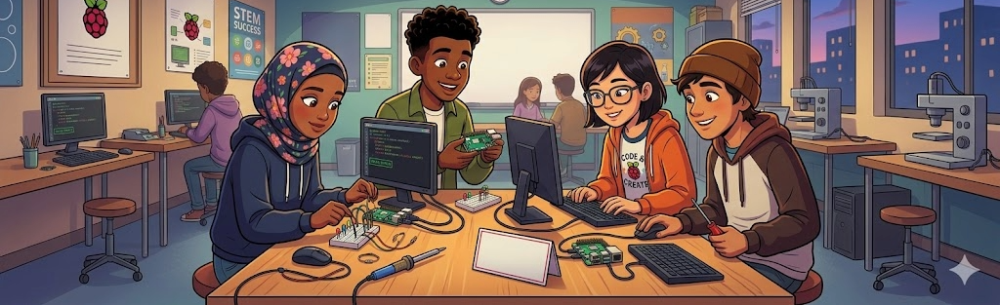

<>

# What Is a Raspberry Pi?

The Raspberry Pi is a small, affordable computer that can run a full operating system, connect to cameras and sensors, and support coding, electronics, and AI projects.

## Why Use It in the Classroom?

Raspberry Pi is useful for classroom learning because it is:
- Low cost compared to full desktop computers.
- Flexible enough for coding, robotics, and AI.
- Small and portable.
- Able to connect to cameras, displays, keyboards, sensors, and network devices.
- Good for project-based learning and hands-on problem solving.

The Raspberry Pi Foundation provides free classroom resources for teachers and students, including AI education resources and computing support:
- [Teaching resources](https://www.raspberrypi.org/teach)
- [AI education](https://www.raspberrypi.org/teach/ai-education)
- [Experience AI](https://experience-ai.org/en/)

## What Can It Do?

A Raspberry Pi can be used for:
- Programming in Python and other languages.
- Running a desktop environment or headless setup.
- Connecting to a camera for image and video processing.
- Working with sensors, motors, LEDs, and other hardware.
- Building AI vision projects such as object detection, motion sensing, and pose estimation.

## Why It Works for AI Vision

Raspberry Pi is a good platform for beginner AI vision projects because students can see real-world input from a camera and connect software results to physical behavior. For example, a system can detect movement, identify a face, or recognize a pose and then trigger an action.

## Key Terms

- **Single-board computer**: A complete computer on one circuit board.
- **Headless**: Running without a monitor, keyboard, or mouse attached.
- **Peripheral**: External devices like a keyboard, mouse, or monitor.
- **Vision system**: Software that analyzes images or video.

## Suggested Next Step

Continue to the equipment and setup guide to learn what you need to get started.
